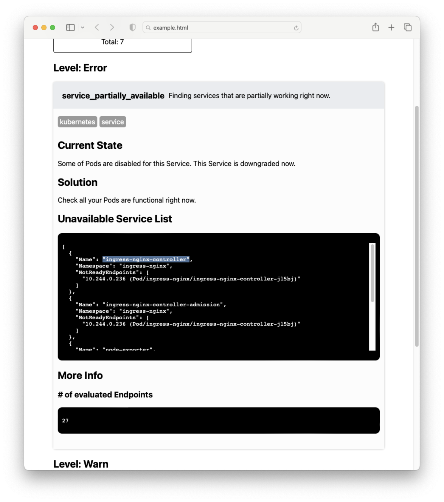

# DETEcting Kubernetes known issues

`detek` is a **extensible problem-detecting tool for reliable Kubernetes cluster operations and rapid problem detections**. It is designed to analyze in-cluster issues **AND** non-Kubernetes, but cluster-related services such as Openstack, Vault, Trivy, SSH, or whatever detek can access.

However, as a Kubernetes exists almost everywhere with various environments and unique operational policies, only "general" features remain here. If you need some new ["Detector" or "Collector"](./cases)  clone this repository and write some code. If you think what you wrote is a "general" case, a contribution is welcomed!

## So what does this tool do for me?

Show a current state of your cluster likes below! :-D




## How to use this?

### with kubectl

```sh
kubectl create ns detek
# warn: predefined "view" clusterrole does not allow access to "core/v1/node" object
kubectl create clusterrolebinding detek --clusterrole view --serviceaccount detek:default
kubectl -n detek create job task --image ghcr.io/kakao/detek:latest

# wait until the task is completed
kubectl -n detek get pod -w

# get the report
kubectl -n detek logs job/task > report.html
# open report.html

# delete everything
kubectl delete clusterrolebinding detek
kubectl delete ns detek
```

### with Docker

You can use detek with the below docker command.

```sh
# on bash
# will use kubeconfig in "~/.kube/config"
docker run --rm -v ~/.kube:/.kube ghcr.io/kakao/detek:latest run --kubeconfig /.kube/config -f html > report.html
```

### with Source

with **`go >= 1.19`**

```sh
> go install github.com/kakao/detek@latest

# will use kubeconfig in "$HOME/.kube/config"
> detek run -f html > report.html
```

## How to customize this?

Clone this repo, and [check this](./cases)

## License

This software is licensed under the [Apache 2 license](LICENSE), quoted below.

Copyright 2022 Kakao Corp. <http://www.kakaocorp.com>

Licensed under the Apache License, Version 2.0 (the "License"); you may not
use this project except in compliance with the License. You may obtain a copy
of the License at http://www.apache.org/licenses/LICENSE-2.0.

Unless required by applicable law or agreed to in writing, software
distributed under the License is distributed on an "AS IS" BASIS, WITHOUT
WARRANTIES OR CONDITIONS OF ANY KIND, either express or implied. See the
License for the specific language governing permissions and limitations under
the License.
